# Ralph Dashboard

A real-time web UI for monitoring, controlling, and analyzing [Ralph](https://ghuntley.com/ralph/) AI agent sessions. Ralph is a technique — in its purest form, a bash loop that feeds a prompt to an AI coding tool over and over, building software iteratively. This dashboard lets you watch it happen live — charts, iteration tracking, plan progress, log streaming, and full process control from your browser.


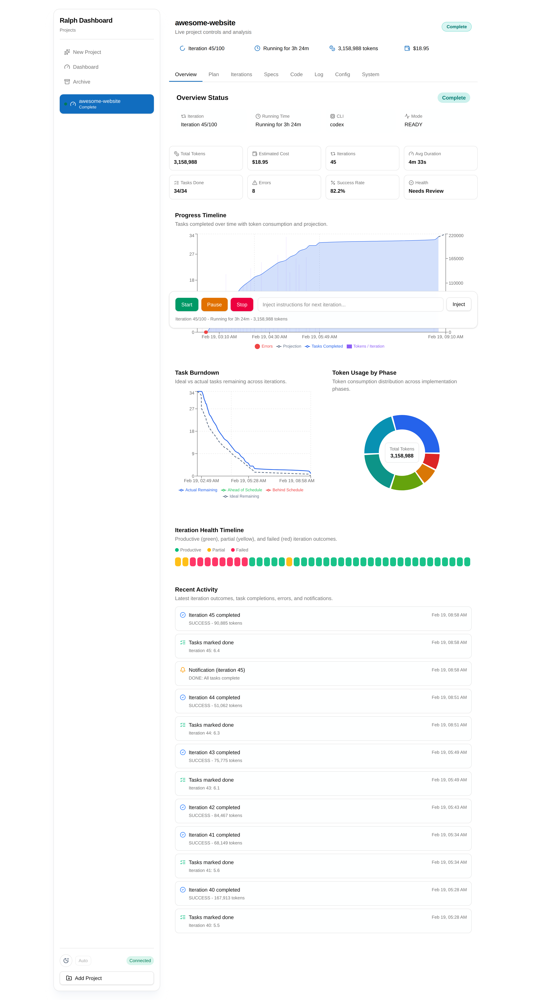
*Project overview with live stats, progress charts, task burndown, token usage breakdown, and iteration health timeline.*

### More Screenshots

<details>
<summary>📊 Dashboard & Project List</summary>

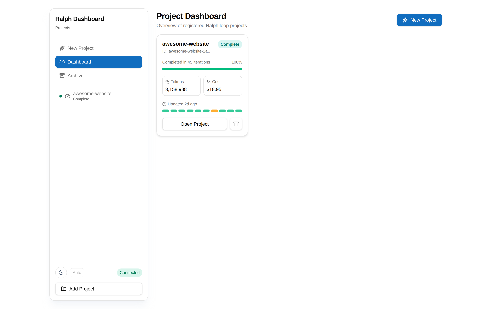
*Project cards with completion status, iteration count, token usage, and cost.*
</details>

<details>
<summary>📋 Plan Management</summary>

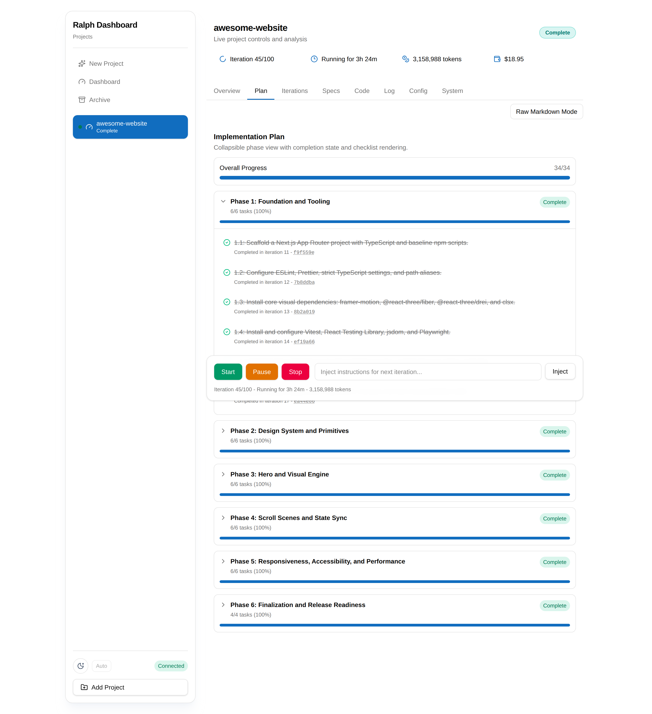
*Interactive task board with phase progress bars, parsed from IMPLEMENTATION_PLAN.md.*
</details>

<details>
<summary>🔄 Iteration Tracking</summary>

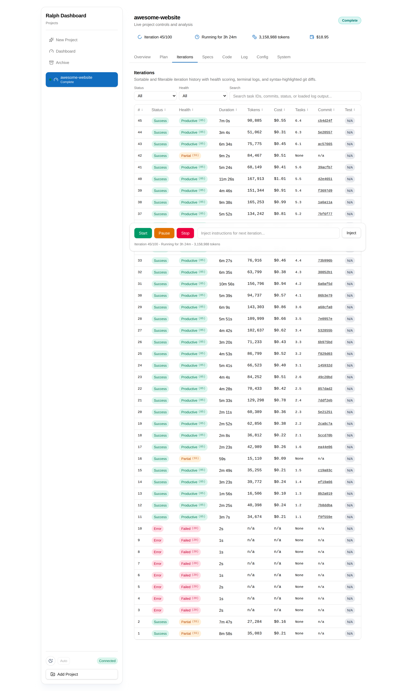
*Sortable iteration table with status, health, duration, tokens, cost, and tasks.*

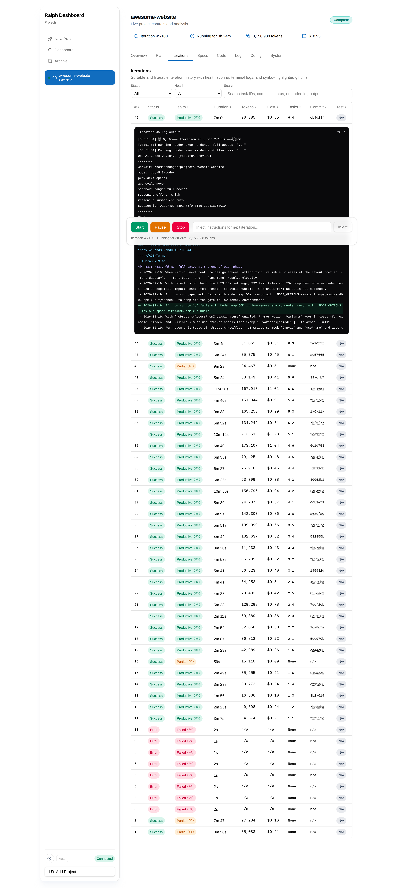
*Expanded iteration with full terminal output and ANSI color rendering.*
</details>

<details>
<summary>📝 Specs & Prompts</summary>

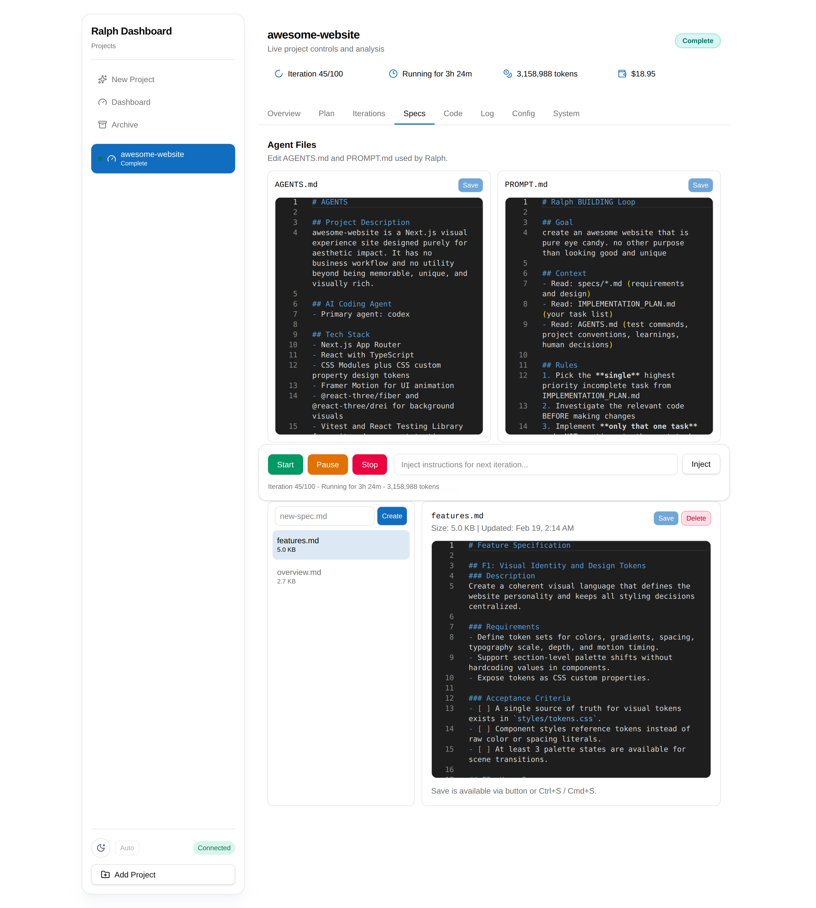
*Browse, create, and edit spec files with side-by-side AGENTS.md and PROMPT.md editors.*
</details>

<details>
<summary>💻 Code & Git History</summary>

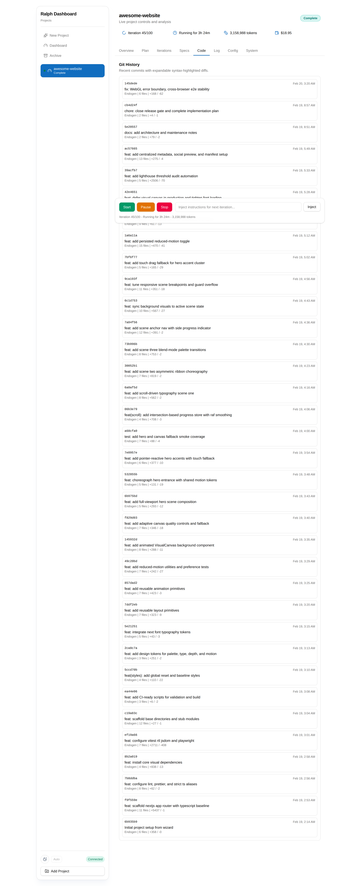
*Git commit history with file counts, insertions, and deletions.*

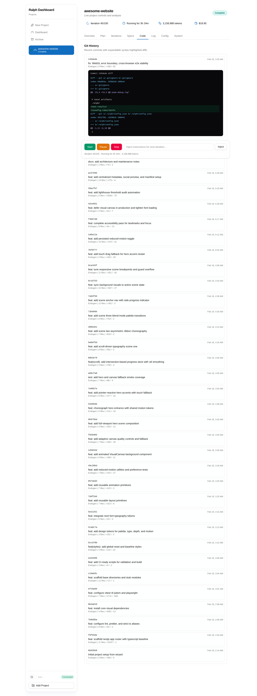
*Expanded commit with syntax-highlighted diff viewer.*
</details>

<details>
<summary>⚙️ Config & System</summary>

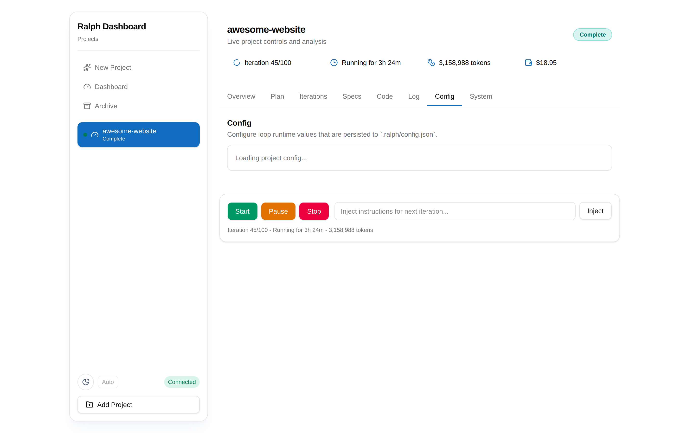
*Loop configuration — CLI tool, flags, max iterations, and test command.*

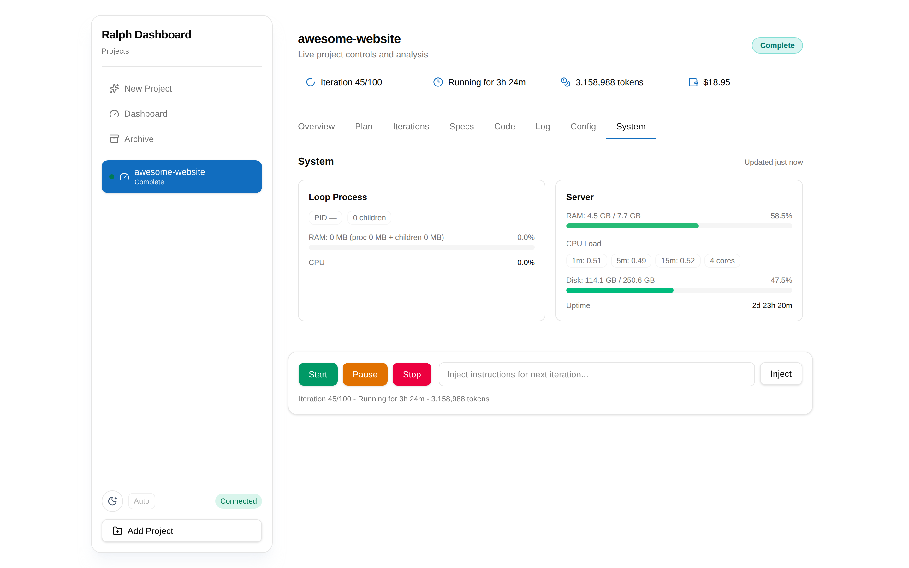
*System metrics — loop process stats, server RAM/CPU/disk usage, and uptime.*
</details>

<details>
<summary>🧙 Project Wizard</summary>

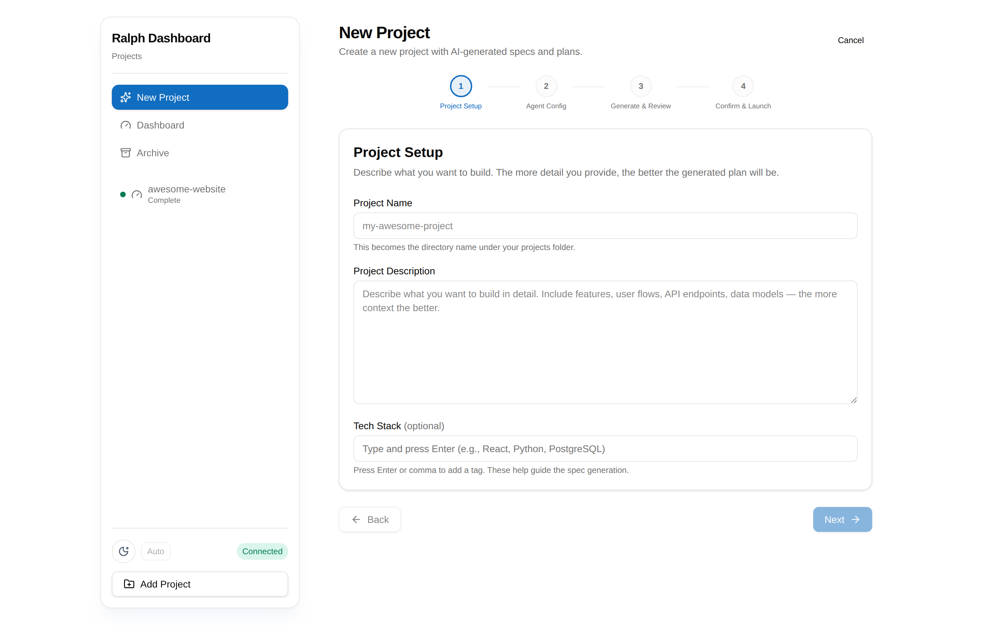
*Step 1: Project setup — name, path, and description.*

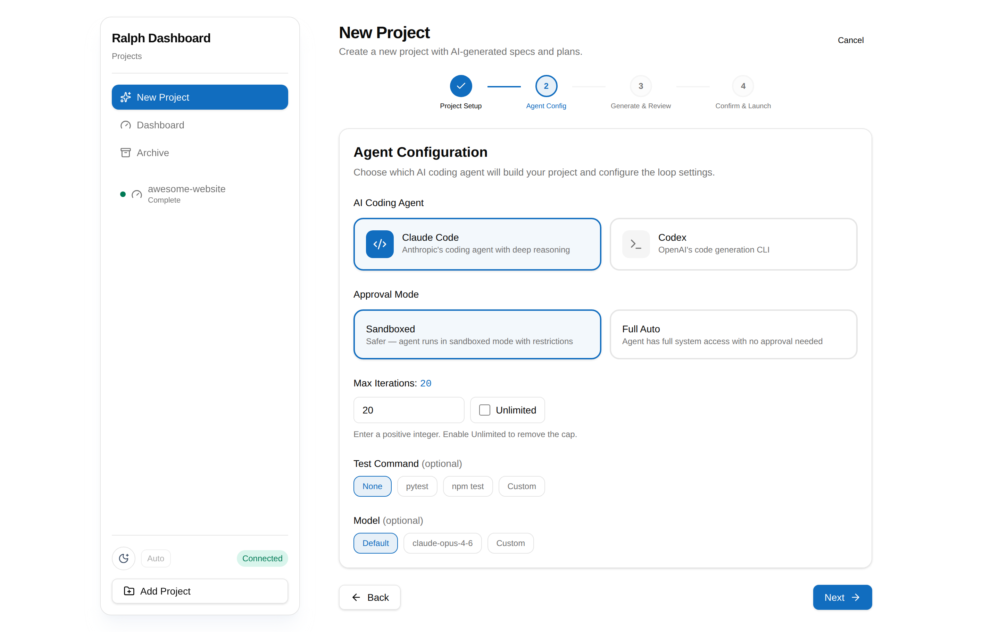
*Step 2: Agent configuration — CLI tool, model, and flags.*

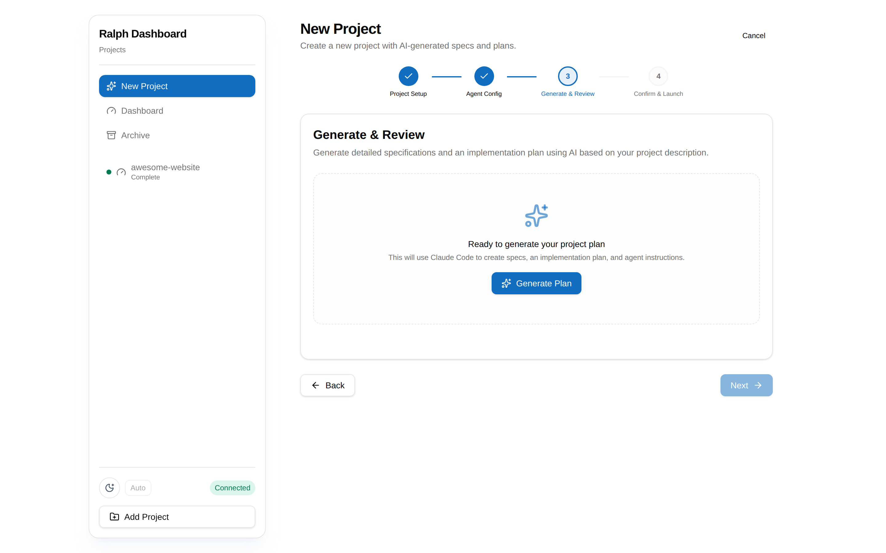
*Step 3: Generate & review — AI-powered plan generation.*
</details>

<details>
<summary>📦 Archive</summary>

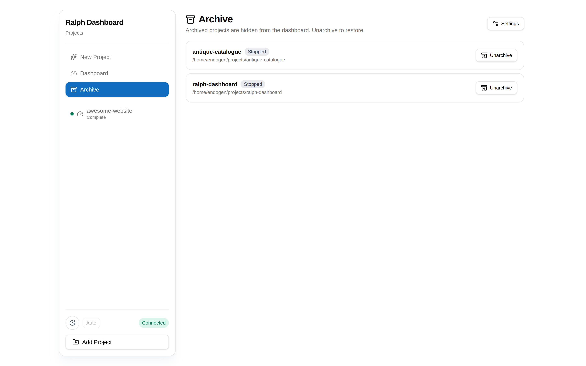
*Browse and restore archived projects.*
</details>

## Start Here
- [Local Setup](#local-setup)
- [Server Setup](#server-setup)

## Features

### 📊 Live Overview
- **Stats grid** — tokens used, estimated cost, iterations completed, success rate, tasks done, error count
- **Progress timeline** — combined bar + line chart showing task completion and token usage per iteration
- **Task burndown** — remaining tasks over time with projected completion
- **Token usage by phase** — pie chart breaking down token spend per implementation phase
- **Iteration health timeline** — color-coded blocks showing productive / partial / failed outcomes
- **Recent activity feed** — merged stream of iteration completions, task checkoffs, errors, and notifications

### 📋 Plan Management
- **Task board** — rendered from `IMPLEMENTATION_PLAN.md` with phase progress, checkmark/hourglass status icons
- **Phase progress bars** — per-phase completion tracking with task counts
- **Raw markdown editor** — toggle to edit the plan directly with live save
- **Task metadata** — shows which iteration completed each task and links to the commit

### 🔄 Iteration Tracking
- **Sortable table** — 10 columns (#, status, health, duration, tokens, cost, tasks, commit, test)
- **Expandable log output** — click any iteration to see its full terminal output with ANSI color rendering
- **Git diff viewer** — syntax-highlighted diffs for each iteration's commit
- **Health scoring** — automatic classification of iterations as productive, partial, or failed

### 📝 Specs & Prompts
- **Browse, create, edit, delete** spec markdown files in the project's `specs/` directory
- **Side-by-side editors** for `AGENTS.md` and `PROMPT.md` directly in the Specs tab
- **Monaco editor** with markdown syntax highlighting

### 💻 Code
- **Git history** — browse recent commits with expandable syntax-highlighted diffs
- **Commit deep-linking** — plan task commit links open the Code tab at that commit

### ⚙️ Config & Injection
- **Runtime injection** — send instructions to the next loop iteration via `.ralph/inject.md`
- **Loop configuration** — edit max iterations (including unlimited), CLI tool, flags, and test commands

### 📺 Live Log Streaming
- **WebSocket-powered** real-time log output with ANSI color support
- **Virtualized rendering** — handles massive logs without DOM bloat
- **Search and filter** — find specific text or filter to errors only
- **Iteration navigation** — jump between iteration markers in the log
- **Auto-scroll** with pin/unpin toggle

### 📦 Project Archiving
- **Manual archive/unarchive** — hide inactive projects from the dashboard, restore them anytime
- **Archive page** — browse archived projects without loading iteration data
- **Auto-archive** — configurable: automatically archive projects with no activity for N days
- **Settings panel** — toggle auto-archiving and adjust the inactivity threshold

### 🎮 Process Control
- **Start / Stop / Pause / Resume** Ralph loops directly from the dashboard
- **Sticky control bar** — always-visible bottom bar with quick actions
- **Status detection** — reads `.ralph/ralph.pid` and process state in real time

### 🖥️ System Metrics
- **Loop process stats** — RAM usage (RSS), CPU %, child process count, PID monitoring
- **Server metrics** — total/used/available RAM, CPU load averages (1m/5m/15m), disk usage, uptime
- **Color-coded gauges** — green/amber/red thresholds for resource usage
- **Auto-refresh** — polls every 5 seconds with live timestamp

### 🔔 Real-Time Updates
- **WebSocket push** via filesystem watchers (watchdog + inotify)
- **Live events** — plan updates, iteration completions, status changes, log appends, notifications
- **Per-project subscriptions** — only receive events for projects you're viewing

## How Project Tracking Works

The dashboard automatically discovers and tracks Ralph Loop projects — no registration or configuration per project is needed.

### Discovery

On startup (and periodically via filesystem watchers), the dashboard scans all directories listed in `RALPH_PROJECT_DIRS` (default: `~/projects`) recursively. Any directory containing a `.ralph/` subdirectory is recognized as a Ralph Loop project.

```
~/projects/
├── my-app/              ← tracked (has .ralph/)
│   ├── .ralph/
│   ├── PROMPT.md
│   └── ...
├── some-library/        ← NOT tracked (no .ralph/)
│   └── src/
└── another-project/     ← tracked (has .ralph/)
    └── .ralph/
```

**That's all you need:** put your project under a scanned directory and make sure the Ralph Loop script has created the `.ralph/` folder. The dashboard picks it up automatically.

### What the dashboard reads

From `.ralph/`:

| File | Purpose |
|------|---------|
| `iterations.jsonl` | Structured data per iteration (timing, tokens, tasks, commits, test results) |
| `ralph.pid` | PID of the running loop process — used to detect running/stopped state |
| `ralph.log` | Human-readable log output, streamed live via WebSocket |
| `config.json` | Loop configuration (CLI tool, flags, max iterations, test command) |
| `pause` | Sentinel file — presence means the loop is paused |
| `inject.md` | Runtime instructions injected into the next iteration |
| `pending-notification.txt` | Current pending notification from the agent |

From the project root:

| File | Purpose |
|------|---------|
| `IMPLEMENTATION_PLAN.md` | Task list with completion status, parsed into an interactive board |
| `AGENTS.md` | Project context and agent instructions |
| `PROMPT.md` | The prompt template used each iteration |
| `specs/*.md` | Requirement/design spec files |

### Minimum viable setup

To get a project tracked by the dashboard, you need at minimum:

1. A project directory under one of the `RALPH_PROJECT_DIRS` paths
2. A `.ralph/` subdirectory inside it (created automatically by `ralph.sh`)

Everything else is optional — the dashboard gracefully handles missing files and shows whatever data is available.

## Architecture

```
┌──────────────────────────────────────────────┐
│  Browser (React 19 + Vite 7 + Tailwind 4)    │
│  ┌──────────┐ ┌──────────┐ ┌─────────────┐   │
│  │ Zustand  │ │ Recharts │ │   Monaco    │   │
│  │ stores   │ │ charts   │ │   editor    │   │
│  └────┬─────┘ └──────────┘ └─────────────┘   │
│       │  REST + WebSocket                    │
└───────┼──────────────────────────────────────┘
        │
┌───────┼──────────────────────────────────────┐
│  Nginx (TLS termination, reverse proxy)      │
└───────┼──────────────────────────────────────┘
        │
┌───────┼──────────────────────────────────────┐
│  FastAPI backend (uvicorn)                   │
│  ┌──────────┐ ┌───────────┐ ┌────────────┐   │
│  │ REST API │ │ WebSocket │ │  File      │   │
│  │ routes   │ │ hub       │ │  watcher   │   │
│  └──────────┘ └───────────┘ └────────────┘   │
│  ┌──────────┐ ┌───────────┐ ┌────────────┐   │
│  │ Plan     │ │ Iteration │ │  Git       │   │
│  │ parser   │ │ parser    │ │  service   │   │
│  └──────────┘ └───────────┘ └────────────┘   │
│  ┌──────────┐ ┌───────────┐ ┌────────────┐   │
│  │ Process  │ │ Stats &   │ │  JWT auth  │   │
│  │ manager  │ │ projector │ │  (SQLite)  │   │
│  └──────────┘ └───────────┘ └────────────┘   │
└───────┼──────────────────────────────────────┘
        │
┌───────┼──────────────────────────────────────┐
│  Filesystem                                  │
│  ~/projects/                                 │
│    ├── my-project/                           │
│    │   ├── .ralph/                           │
│    │   │   ├── ralph.log        (log output) │
│    │   │   ├── ralph.pid        (process id) │
│    │   │   ├── iterations.jsonl (structured) │
│    │   │   ├── config.json      (loop config)│
│    │   │   └── inject.md        (runtime msg)│
│    │   ├── IMPLEMENTATION_PLAN.md            │
│    │   ├── AGENTS.md                         │
│    │   ├── PROMPT.md                         │
│    │   └── specs/*.md                        │
│    └── another-project/                      │
│        └── .ralph/ ...                       │
└──────────────────────────────────────────────┘
```

## Tech Stack

| Layer | Technology |
|-------|-----------|
| **Frontend** | React 19, Vite 7, TypeScript 5.9, Tailwind CSS 4, shadcn/ui |
| **Charts** | Recharts 3 |
| **Editor** | Monaco Editor (via @monaco-editor/react) |
| **State** | Zustand 5 |
| **Routing** | React Router 7 |
| **Backend** | Python 3.12+, FastAPI 0.129, Uvicorn |
| **Database** | SQLite (via aiosqlite) — auth & settings only |
| **File Watching** | watchdog (inotify on Linux) |
| **Git** | GitPython |
| **Auth** | JWT (python-jose) + bcrypt (passlib) |
| **System Metrics** | psutil |
| **Reverse Proxy** | Nginx with Let's Encrypt TLS |

## Local Setup

### Prerequisites
- Python 3.12+
- Git
- Node.js 22+ and npm (only needed if frontend assets are missing, or when developing the frontend)
- An AI coding CLI if you plan to run loops from this machine ([Codex](https://github.com/openai/codex), [Claude Code](https://github.com/anthropics/claude-code), etc.)

### Step 1: Install CLI and dependencies (once)

```bash
git clone https://github.com/Endogen/ralph-dashboard.git
cd ralph-dashboard
./scripts/install.sh
```

`scripts/install.sh` creates/updates `backend/.venv`, installs the `ralph-dashboard` CLI wrapper in `~/.local/bin`, and packages frontend assets when possible.

If `ralph-dashboard` is not found after install, ensure `~/.local/bin` is on your `PATH`.

Choose one run method below. Each method includes `ralph-dashboard init`.

### Method 1: Linux user service (recommended)

```bash
# Creates ~/.config/ralph-dashboard/env + credentials (first run)
ralph-dashboard init
ralph-dashboard doctor
ralph-dashboard service install --user --start
```

Useful service commands:

```bash
ralph-dashboard service status
ralph-dashboard service logs -f
ralph-dashboard service stop
ralph-dashboard service start
```

Open `http://127.0.0.1:8420` (or your configured `RALPH_PORT`) and log in.

### Method 2: macOS launchd user agent

```bash
# Creates ~/.config/ralph-dashboard/env + credentials (first run)
ralph-dashboard init
ralph-dashboard doctor
ralph-dashboard launchd install --start
```

Useful launchd commands:

```bash
ralph-dashboard launchd status
ralph-dashboard launchd logs -f
ralph-dashboard launchd stop
ralph-dashboard launchd start
```

### Method 3: Manual run (macOS or Linux)

```bash
# Creates ~/.config/ralph-dashboard/env + credentials (first run)
ralph-dashboard init
ralph-dashboard doctor

set -a
source ~/.config/ralph-dashboard/env
set +a
cd backend
.venv/bin/uvicorn app.main:app --host 127.0.0.1 --port "$RALPH_PORT"
```

### Method 4: Dashboard development workflow

Use this when actively developing `ralph-dashboard` itself:

```bash
cd backend
python3 -m venv .venv
source .venv/bin/activate
pip install -e ".[dev]"

cd ../frontend
npm install --legacy-peer-deps

# Build frontend and package into backend/app/static/dist
cd ..
ralph-dashboard build-frontend

# Creates ~/.config/ralph-dashboard/env + credentials (first run)
ralph-dashboard init
ralph-dashboard doctor
```

## Server Setup

Use this for a persistent deployment on a Linux host.

### Prerequisites
- Linux server (Ubuntu 22.04+ recommended)
- Python 3.12+
- Git
- Node.js 22+ and npm (only needed when frontend assets are not pre-packaged)

### Method 1: Server install + systemd user service

```bash
git clone https://github.com/Endogen/ralph-dashboard.git
cd ralph-dashboard
./scripts/install.sh
ralph-dashboard init
ralph-dashboard doctor
ralph-dashboard service install --user --start
```

This writes `~/.config/systemd/user/ralph-dashboard.service`, reloads the user daemon, enables the unit, and starts it.

If the service should survive logout/reboot, enable linger once:

```bash
sudo loginctl enable-linger "$USER"
```

### Method 1A: Non-interactive bootstrap (automation)

Use this when provisioning a server from CI/cloud-init/Ansible.

```bash
RALPH_ADMIN_USER="admin"
RALPH_ADMIN_PASSWORD="change-me-now"

ralph-dashboard init \
  --project-dirs /srv/projects \
  --port 8420 \
  --username "$RALPH_ADMIN_USER" \
  --password "$RALPH_ADMIN_PASSWORD" \
  --password-confirm "$RALPH_ADMIN_PASSWORD" \
  --force

ralph-dashboard doctor
ralph-dashboard service install --user --start
```

This avoids interactive prompts and auto-generates `RALPH_SECRET_KEY` when omitted. If you need to inject a managed secret, pass `--secret-key "$RALPH_SECRET_KEY"` explicitly.

### Method 2: Reverse proxy + TLS (internet-facing)

Complete Method 1 or Method 1A first (both run `ralph-dashboard init`).

An example nginx config is included at `scripts/nginx/ralph.xian.technology.conf`. Copy it to `/etc/nginx/sites-available/`, adjust domain/certificate paths, symlink to `sites-enabled`, and reload:

```bash
sudo nginx -t && sudo systemctl reload nginx
```

Issue certificates with Let's Encrypt:

```bash
sudo certbot --nginx -d your.domain.com
```

## Runtime Configuration (Advanced)

Most users should not set env vars manually. Use `ralph-dashboard init` and let it generate runtime config files:

- `~/.config/ralph-dashboard/env`
- `~/.config/ralph-dashboard/credentials.yaml`

Ralph uses `~/.config/ralph-dashboard/env` by default (not a repo-local `.env` file).

If you need to manage values manually, use this reference:

| Environment Variable | Required | Default | Description |
|---------------------|----------|---------|-------------|
| `RALPH_SECRET_KEY` | Yes | *(none)* | JWT signing key. Auto-generated by `ralph-dashboard init`; if set manually, use a secure random value. |
| `RALPH_PROJECT_DIRS` | No | `~/projects` | Project root directories to scan for `.ralph/` projects (path-separated or comma-separated). |
| `RALPH_PORT` | No | `8420` | Backend server port. |
| `RALPH_CREDENTIALS_FILE` | No | `~/.config/ralph-dashboard/credentials.yaml` | Path to dashboard credentials file. |
| `RALPH_FRONTEND_DIST` | No | *(auto-detected)* | Optional override for frontend dist directory served by FastAPI. |

Tracked template: `.env.example`

Example env file:

```bash
# ~/.config/ralph-dashboard/env
RALPH_SECRET_KEY=replace-with-random-secret
RALPH_PROJECT_DIRS=/home/you/projects
RALPH_PORT=8420
RALPH_CREDENTIALS_FILE=/home/you/.config/ralph-dashboard/credentials.yaml
```

## Connect Ralph Loop Projects (Local or Server)

The dashboard discovers projects under `RALPH_PROJECT_DIRS` that contain a `.ralph/` directory.

### 1. Copy the loop script

```bash
cp scripts/ralph.sh ~/ralph.sh
chmod +x ~/ralph.sh
```

### 2. Create a project

```bash
mkdir -p ~/projects/my-project
cd ~/projects/my-project

cat > AGENTS.md << 'EOF'
# My Project

## Build Commands
- Build: `npm run build`
- Test: `npm test`
- Lint: `npx eslint .`
EOF

cat > PROMPT.md << 'EOF'
You are building my-project. Read AGENTS.md for context.
Follow IMPLEMENTATION_PLAN.md for tasks.
Work on one task per iteration.
EOF

cat > IMPLEMENTATION_PLAN.md << 'EOF'
# Implementation Plan

STATUS: IN PROGRESS

## Phase 1: Setup
- [ ] 1.1: Initialize project structure
- [ ] 1.2: Add core dependencies
EOF

git init && git add -A && git commit -m "initial"
```

### 3. Start a Ralph loop

```bash
cd ~/projects/my-project

# Uses Codex by default
~/ralph.sh 10

# Example with another CLI
RALPH_CLI=claude-code ~/ralph.sh 10
```

The loop creates `.ralph/` automatically. Refresh the dashboard and the project should appear.

## Project Structure

```
ralph-dashboard/
├── .env.example               # Template for runtime environment variables
├── backend/                   # FastAPI backend (58 Python files)
│   ├── app/
│   │   ├── auth/              # JWT authentication & user management
│   │   ├── cli/               # `ralph-dashboard` operational CLI
│   │   ├── control/           # Process lifecycle (start/stop/pause/inject)
│   │   ├── files/             # AGENTS.md, PROMPT.md, specs CRUD
│   │   ├── git_service/       # Git log & diff via GitPython
│   │   ├── iterations/        # Log & JSONL iteration parsers
│   │   ├── notifications/     # Ralph notification file parsing
│   │   ├── plan/              # IMPLEMENTATION_PLAN.md parser
│   │   ├── projects/          # Project discovery, registration, status
│   │   ├── stats/             # Aggregation, projections, reports
│   │   ├── system/            # System & process metrics (psutil)
│   │   ├── ws/                # WebSocket hub, file watcher, event dispatcher
│   │   └── static/            # Optional packaged frontend dist for no-Node installs
│   └── tests/                 # 126 tests (pytest)
├── frontend/                  # React SPA (43 TS/TSX files)
│   └── src/
│       ├── api/               # API client with auth refresh
│       ├── components/
│       │   ├── charts/        # Recharts visualizations
│       │   ├── layout/        # Page shells, top bar, control bar
│       │   ├── project/       # Tab content components
│       │   └── ui/            # shadcn/ui primitives
│       ├── hooks/             # WebSocket hook
│       ├── lib/               # Utilities
│       ├── stores/            # Zustand state stores
│       └── types/             # TypeScript type definitions
├── scripts/
│   ├── install.sh             # One-command local installer
│   ├── package_frontend.sh    # Copies built frontend into backend static dist
│   ├── ralph.sh               # Ralph loop runner script
│   └── nginx/                 # Example nginx config
└── specs/                     # Design specification documents
```

## API Overview

All API endpoints are under `/api/` and require a Bearer JWT token (except `/api/health`, `/api/auth/login`, `/api/auth/refresh`).

| Method | Endpoint | Description |
|--------|----------|-------------|
| `GET` | `/api/health` | Health check |
| `POST` | `/api/auth/login` | Login (returns access + refresh tokens) |
| `POST` | `/api/auth/refresh` | Refresh access token |
| `GET` | `/api/projects` | List active projects (excludes archived) |
| `GET` | `/api/projects/archived` | List archived projects |
| `GET/PUT` | `/api/projects/archive/settings` | Auto-archive configuration |
| `POST` | `/api/projects/{id}/archive` | Archive a project |
| `POST` | `/api/projects/{id}/unarchive` | Unarchive a project |
| `GET` | `/api/projects/{id}` | Project detail |
| `GET` | `/api/projects/{id}/plan` | Parsed implementation plan |
| `PUT` | `/api/projects/{id}/plan` | Update plan markdown |
| `GET` | `/api/projects/{id}/iterations` | List iterations (filterable) |
| `GET` | `/api/projects/{id}/iterations/{n}` | Iteration detail with log output |
| `GET` | `/api/projects/{id}/stats` | Aggregated stats & projections |
| `GET` | `/api/projects/{id}/system` | System & process metrics |
| `GET` | `/api/projects/{id}/notifications` | Notification history |
| `GET` | `/api/projects/{id}/git/log` | Commit history |
| `GET` | `/api/projects/{id}/git/diff/{hash}` | Commit diff |
| `GET/PUT` | `/api/projects/{id}/files/{name}` | Read/write AGENTS.md or PROMPT.md |
| `GET/POST/PUT/DELETE` | `/api/projects/{id}/specs` | Spec file CRUD |
| `GET/PUT` | `/api/projects/{id}/config` | Loop configuration |
| `POST` | `/api/projects/{id}/inject` | Send runtime instruction |
| `POST` | `/api/projects/{id}/start` | Start Ralph loop |
| `POST` | `/api/projects/{id}/stop` | Stop Ralph loop |
| `POST` | `/api/projects/{id}/pause` | Pause loop |
| `POST` | `/api/projects/{id}/resume` | Resume loop |
| `WS` | `/api/ws?token=...` | WebSocket for real-time events |

## Running Tests

```bash
cd backend
source .venv/bin/activate
pytest tests/ -q
```

## License

MIT
