# Ralph Dashboard

A real-time web UI for monitoring, controlling, and analyzing [Ralph](https://ghuntley.com/ralph/) AI agent sessions. Ralph is a technique — in its purest form, a bash loop that feeds a prompt to an AI coding tool over and over, building software iteratively. This dashboard lets you watch it happen live — charts, iteration tracking, plan progress, log streaming, and full process control from your browser.


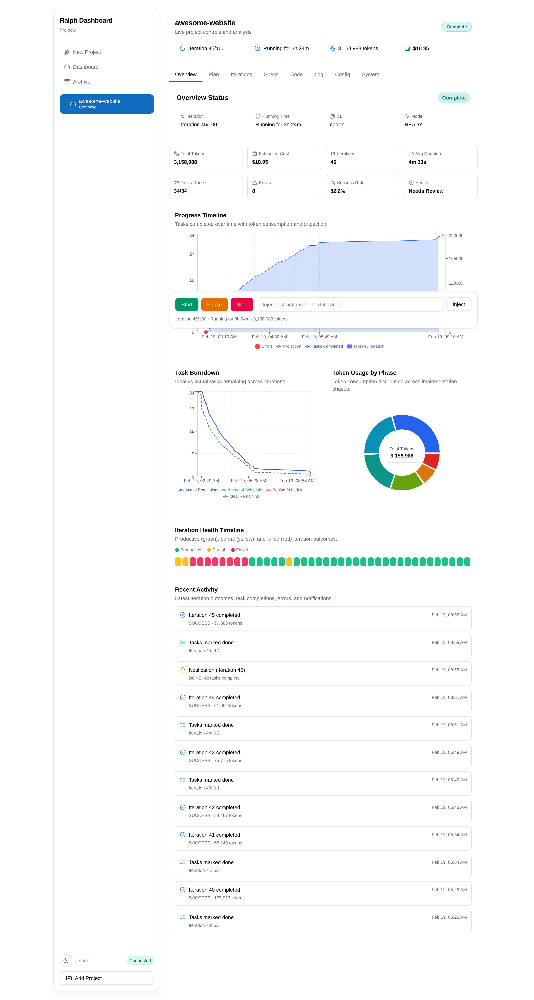
*Project overview with live stats, progress charts, task burndown, token usage breakdown, and iteration health timeline.*

Screenshots illustrate the main workflows; some were captured before the CodeMirror editor update.

### More Screenshots

<details>
<summary>📊 Dashboard & Project List</summary>

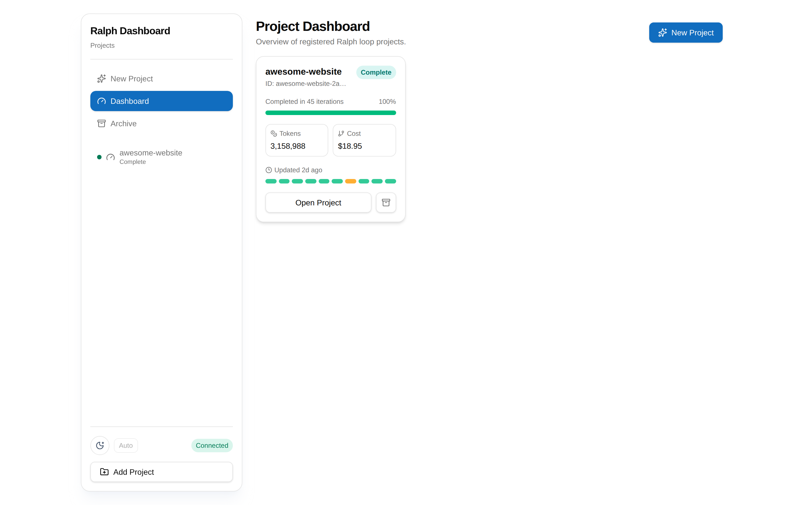
*Project cards with completion status, iteration count, token usage, and cost.*
</details>

<details>
<summary>📋 Plan Management</summary>

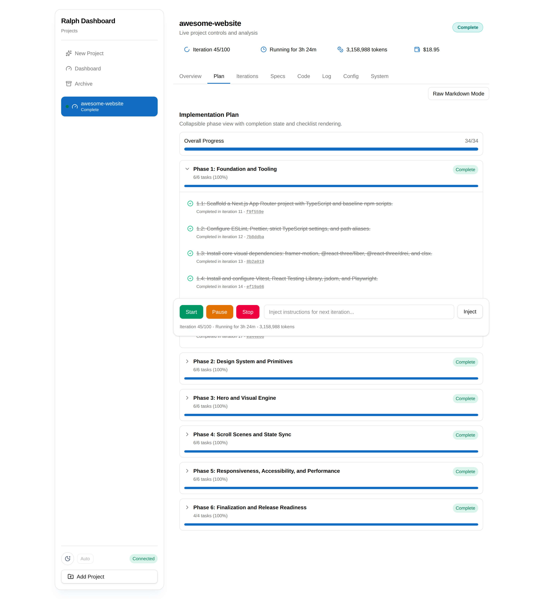
*Read-only task board with phase progress bars, parsed from IMPLEMENTATION_PLAN.md. Use raw Markdown mode to edit.*
</details>

<details>
<summary>🔄 Iteration Tracking</summary>

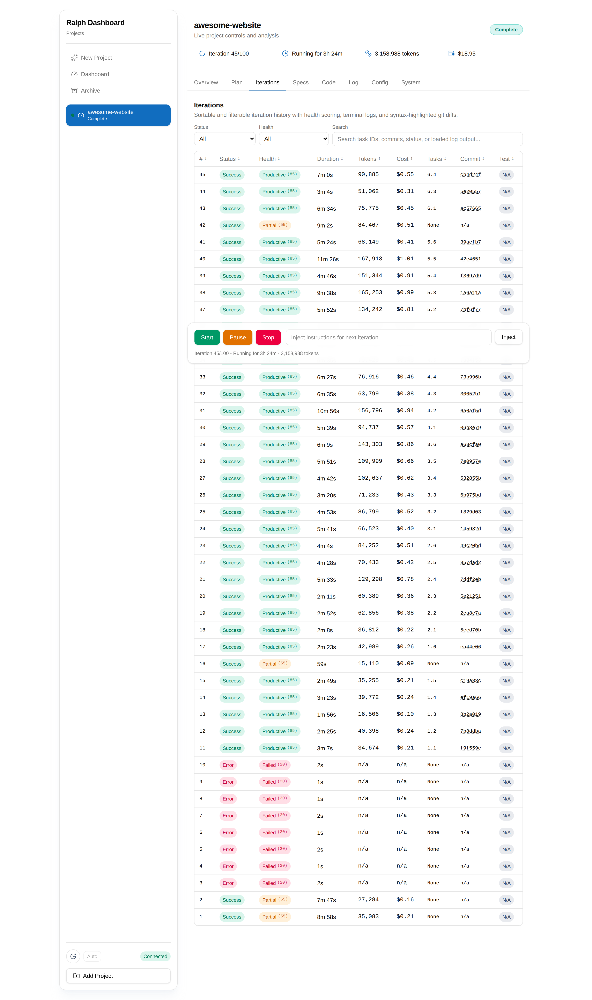
*Sortable iteration table with status, health, duration, tokens, cost, and tasks.*

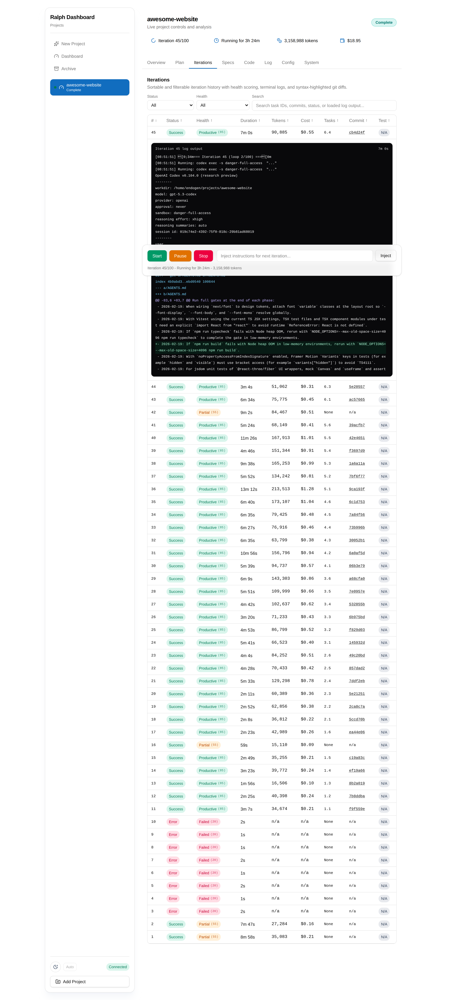
*Expanded iteration with full terminal output and ANSI color rendering.*
</details>

<details>
<summary>📝 Specs & Prompts</summary>

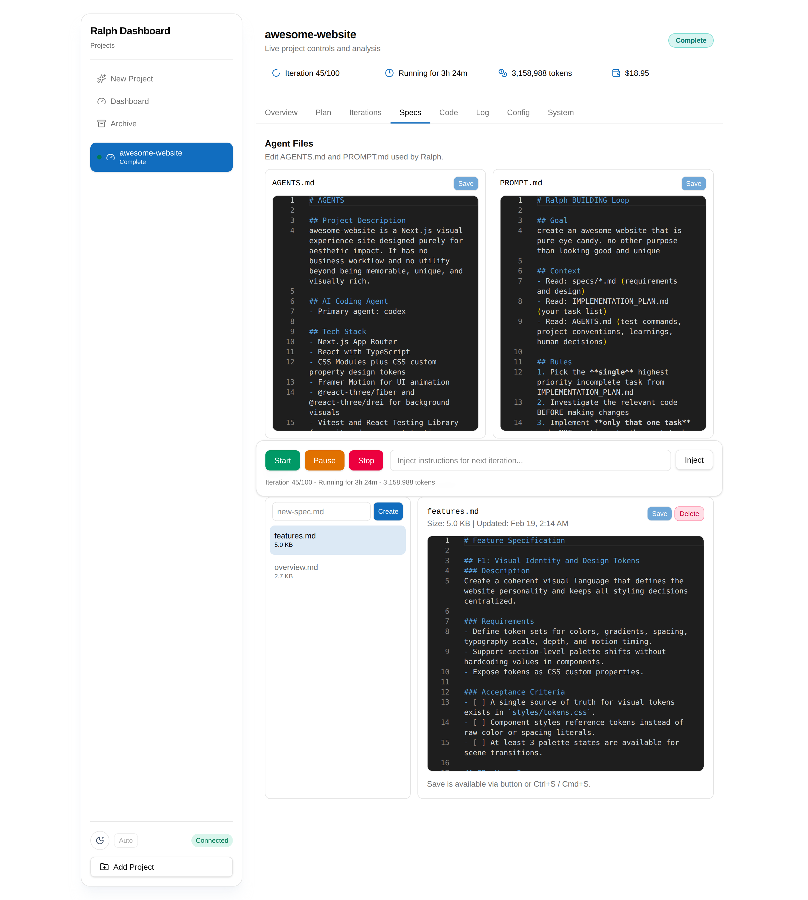
*Browse, create, and edit spec files with side-by-side AGENTS.md and PROMPT.md editors.*
</details>

<details>
<summary>💻 Code & Git History</summary>

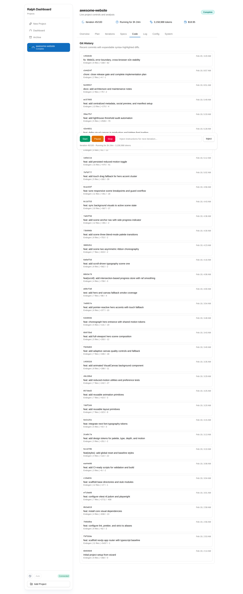
*Git commit history with file counts, insertions, and deletions.*

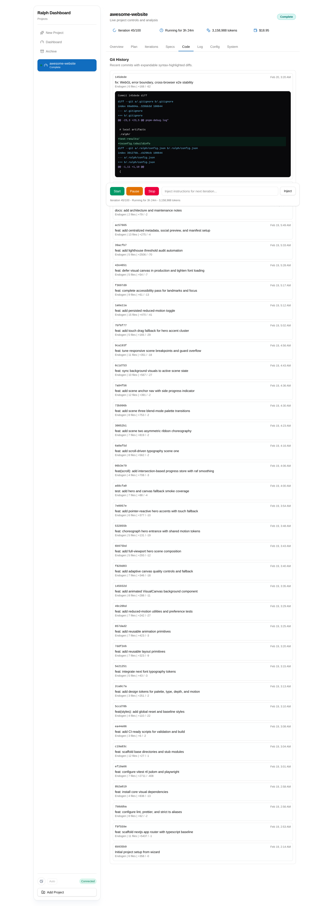
*Expanded commit with syntax-highlighted diff viewer.*
</details>

<details>
<summary>⚙️ Config & System</summary>

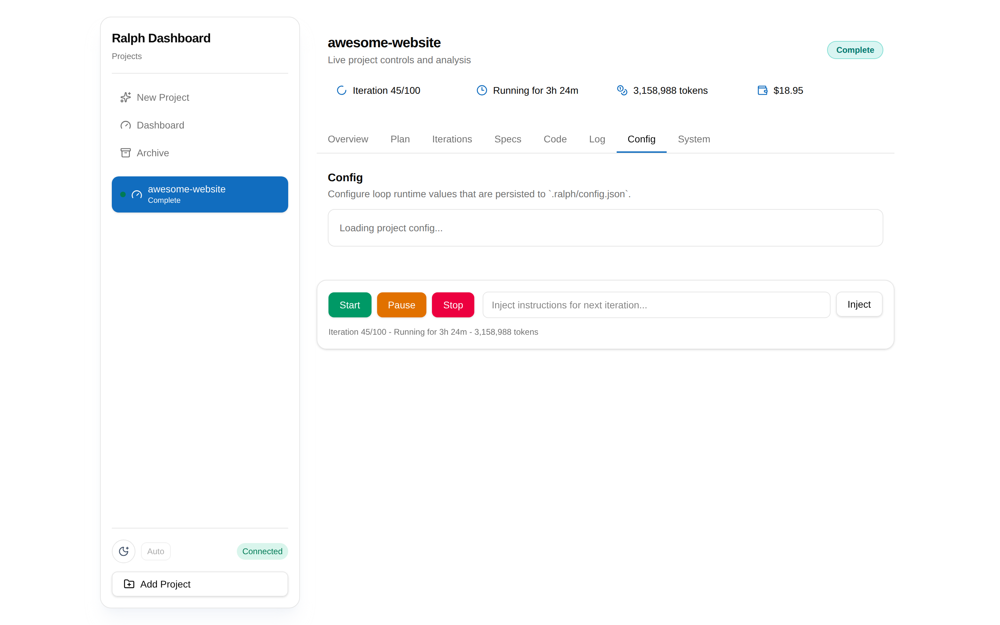
*Loop configuration — CLI tool, flags, max iterations, and test command.*

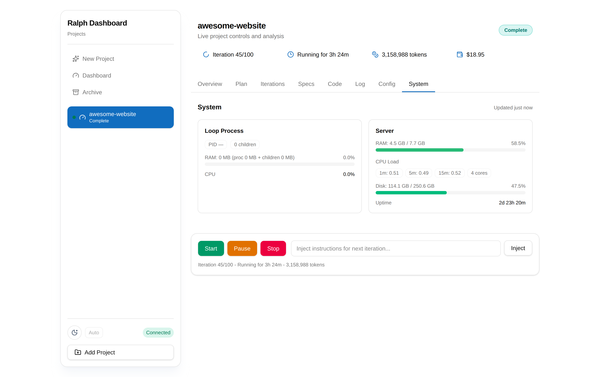
*System metrics — loop process stats, server RAM/CPU/disk usage, and uptime.*
</details>

<details>
<summary>🧙 Project Wizard</summary>

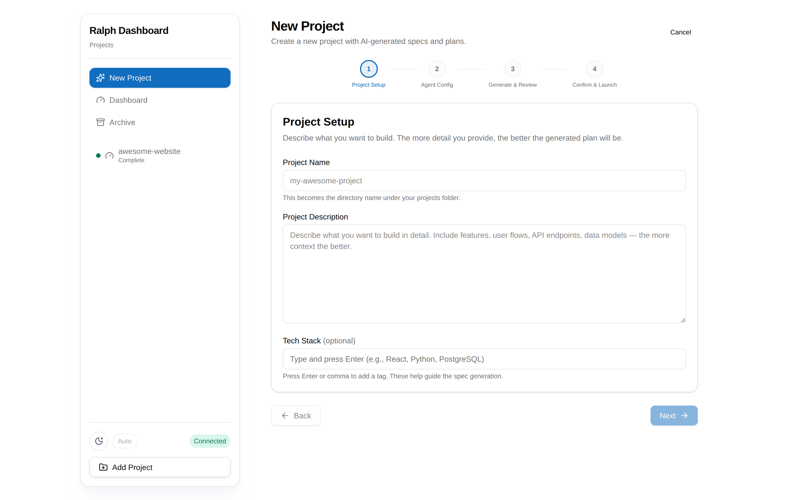
*Step 1: Project setup — name, path, and description.*

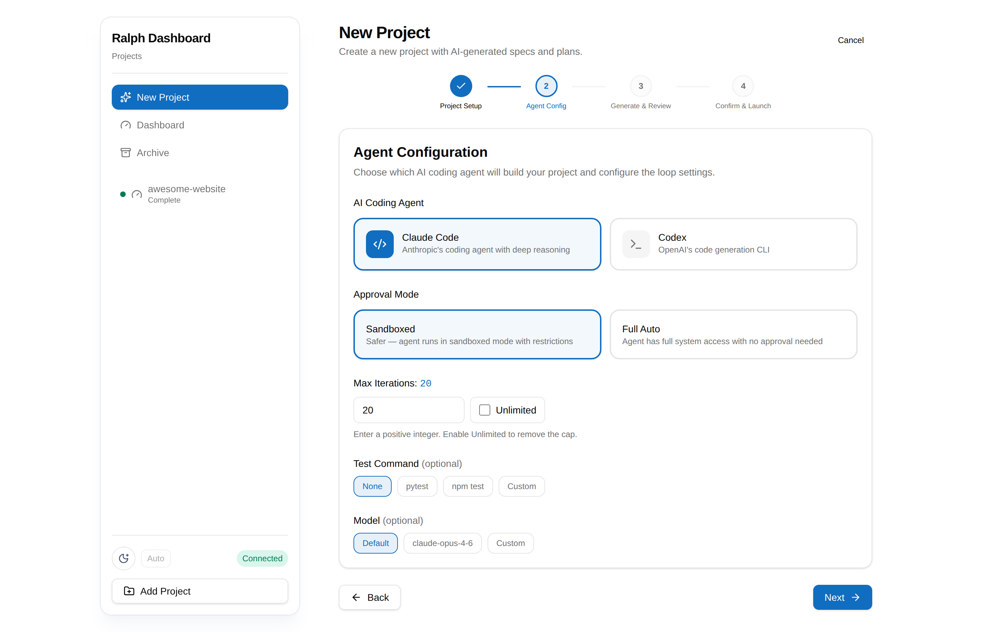
*Step 2: Agent configuration — CLI tool, model, and flags.*

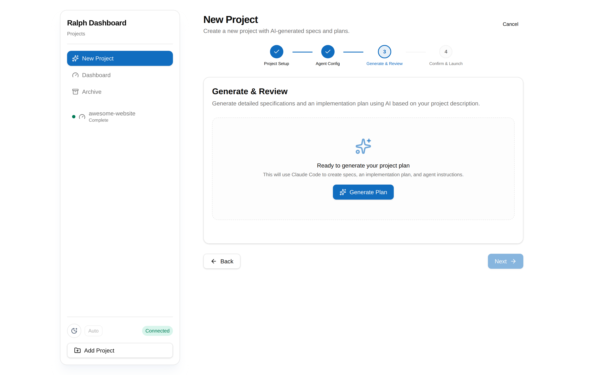
*Step 3: Generate & review — AI-powered plan generation.*
</details>

<details>
<summary>📦 Archive</summary>

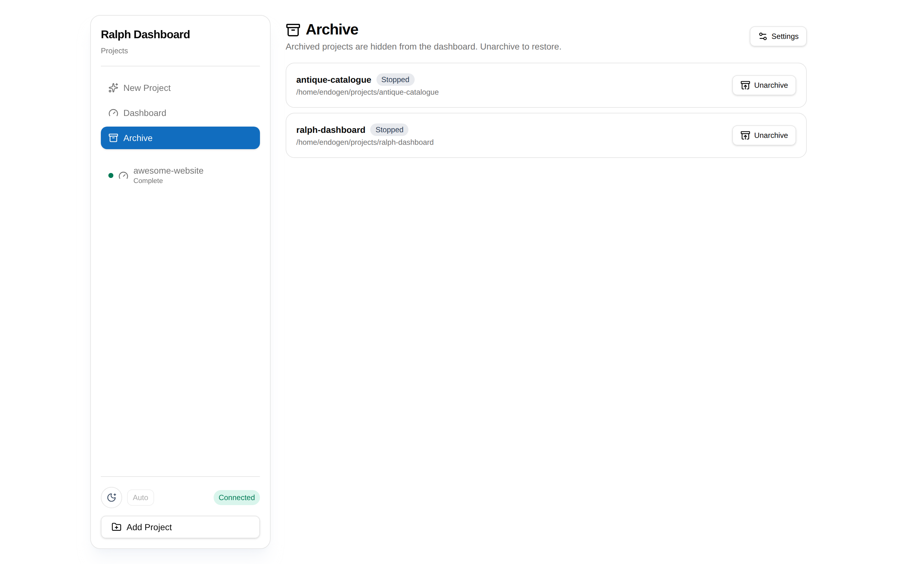
*Browse and restore archived projects.*
</details>

## Start Here

- [Local setup](#local-setup) — install and run on macOS or Linux
- [Server setup](#server-setup) — systemd, reverse proxy and TLS
- [Docker setup](#docker-setup) — container with persistent data and agent credentials
- [Connect projects](#connect-ralph-loop-projects-local-or-server) — existing projects, wizard and runner
- [Runtime configuration](#runtime-configuration-advanced)
- [Updating and backups](#updating-and-backups)
- [Troubleshooting](#troubleshooting)
- [Development and tests](#running-tests)

## Features

### 📊 Live Overview

- **Stats grid** — tokens used, estimated cost, iterations completed, success rate, tasks done, error count
- **Progress timeline** — combined bar + line chart showing task completion and token usage per iteration
- **Task burndown** — remaining tasks over time with projected completion
- **Token usage by phase** — pie chart breaking down token spend per implementation phase
- **Iteration health timeline** — color-coded blocks showing productive / partial / failed outcomes
- **Recent activity feed** — merged stream of iteration completions, task checkoffs, errors, and notifications

### 📋 Plan Management

- **Task board** — rendered from `IMPLEMENTATION_PLAN.md` with phase progress, checkmark/hourglass status icons
- **Phase progress bars** — per-phase completion tracking with task counts
- **Raw markdown editor** — toggle to edit the plan directly; save with the button or Ctrl/Cmd+S (no autosave)
- **Task metadata** — shows which iteration completed each task and links to the commit

### 🔄 Iteration Tracking

- **Sortable table** — iteration number, status, health, duration, tokens, cost, tasks, commit, and test result
- **Expandable log output** — click any iteration to see its full terminal output with ANSI color rendering
- **Git diff viewer** — syntax-highlighted diffs for each iteration's commit
- **Health scoring** — automatic classification of iterations as productive, partial, or failed

### 📝 Specs & Prompts

- **Browse, create, edit, delete** spec markdown files in the project's `specs/` directory
- **Side-by-side editors** for `AGENTS.md` and `PROMPT.md` directly in the Specs tab
- **CodeMirror editor** with Markdown highlighting, search/replace, undo/redo, light/dark themes, and save shortcuts scoped to the focused file

### 🧙 Project Wizard

- **New or existing projects** — generate a plan, instructions, prompt and specs, then review/edit the files before applying them
- **Agent selection** — Codex or Claude, model, permission mode, iteration limit and test command
- **Replacement preview** — inspect files that would change in an existing project; the project must be stopped before preparation
- **Resumable generation** — keep polling or cancel after navigation/reload; wizard drafts persist when browser storage is available
- Generation invokes the selected authenticated CLI and may consume its provider quota. Monitoring and editing files do not require an LLM call.

### 💻 Code

- **Git history** — browse recent commits with expandable syntax-highlighted diffs
- **Commit deep-linking** — plan task commit links open the Code tab at that commit

### ⚙️ Config & Injection

- **Runtime injection** — send instructions to the next loop iteration via `.ralph/inject.md`
- **Loop configuration** — edit max iterations (including unlimited), CLI tool, flags, and test commands

### 📺 Live Log Streaming

- **WebSocket-powered** real-time log output with ANSI color support
- **Virtualized rendering** — keeps a bounded recent log window; older per-iteration output remains available in iteration details
- **Search and filter** — find specific text or filter to errors only
- **Iteration navigation** — jump between iteration markers in the log
- **Auto-scroll** with pin/unpin toggle

### 📦 Project Archiving

- **Manual archive/unarchive** — hide inactive projects from the dashboard, restore them anytime
- **Archive page** — browse archived projects without loading iteration data
- **Auto-archive** — configurable: automatically archive projects with no activity for N days
- **Settings panel** — toggle auto-archiving and adjust the inactivity threshold

### 🎮 Process Control

- **Start / Stop / Pause / Resume** Ralph loops directly from the dashboard; pause takes effect between iterations, while stop interrupts the current process
- **Sticky control bar** — always-visible bottom bar with quick actions
- **Status detection** — combines runner state, PID/process identity and filesystem updates

### 🖥️ System Metrics

- **Loop process stats** — RAM usage (RSS), CPU %, child process count, PID monitoring
- **Server metrics** — total/used/available RAM, CPU load averages (1m/5m/15m), disk usage, uptime
- **Color-coded gauges** — green/amber/red thresholds for resource usage
- **Auto-refresh** — polls every 5 seconds with live timestamp

### 🔔 Real-Time Updates

- **WebSocket push** via filesystem watchers (watchdog + inotify)
- **Live events** — plan updates, iteration completions, status changes, log appends, notifications
- **Per-project subscriptions** — the client subscribes to project IDs and updates the dashboard and active project from one connection

### 🚨 Notifications & Attention Signals

- **Structured notifications** — parses `pending-notification.txt` payloads into typed events with severity, status, details, and iteration context
- **In-app toasts** — `ERROR`, `BLOCKED`, `DECISION`, `DONE`, and `PLANNING_COMPLETE` alerts surface immediately while the dashboard tab is visible
- **Browser notifications** — background alerts use the Browser Notification API when supported and permitted, with in-app fallback
- **Notification history** — live alerts are deduped and persisted so the activity feed and project page keep prior context

## How Project Tracking Works

The dashboard automatically discovers Ralph projects inside configured scan roots. You can also register an existing project with **Add Project**, or prepare one with **New Project**.

### Discovery

On startup and during periodic reconciliation, the dashboard scans all directories listed in `RALPH_PROJECT_DIRS` (default: `~/projects`) recursively. Any directory containing a `.ralph/` subdirectory is recognized as a Ralph Loop project.

```
~/projects/
├── my-app/              ← tracked (has .ralph/)
│   ├── .ralph/
│   ├── PROMPT.md
│   └── ...
├── some-library/        ← NOT tracked (no .ralph/)
│   └── src/
└── another-project/     ← tracked (has .ralph/)
    └── .ralph/
```

For monitoring, place the project under a scan root and create `.ralph/` (the runner also creates it). Discovery refreshes automatically; reload the project list if a newly added folder has not appeared yet.

**Add Project** accepts an existing project path with `.ralph/`, including paths outside the scan roots. This is an authenticated administrator capability: paths are on the machine running the backend, not necessarily your browser's machine. Unregistering removes a manual registration; it does not delete files or hide a project still found by scanning. Use Archive to hide a discovered project.

### What the dashboard reads

From `.ralph/`:

| File | Purpose |
|------|---------|
| `iterations.jsonl` | Structured data per iteration (timing, tokens, tasks, commits, test results) |
| `ralph.pid` | PID of the running loop process |
| `process.json` / `state.json` | Process identity and runner lifecycle/error state |
| `launcher.log` | Startup diagnostics for dashboard-launched loops |
| `ralph.log` | Human-readable log output, streamed live via WebSocket |
| `config.json` | Loop configuration (CLI tool, flags, max iterations, test command) |
| `pause` | Sentinel file — requests a pause between iterations |
| `inject.md` | Runtime instructions injected into the next iteration |
| `pending-notification.txt` | Current pending notification from the agent |
| `notifications/events.jsonl` | Persisted notification history captured from live alerts |

From the project root:

| File | Purpose |
|------|---------|
| `IMPLEMENTATION_PLAN.md` | Task list with completion status, parsed into a read-only task board |
| `AGENTS.md` | Project context and agent instructions |
| `PROMPT.md` | The prompt template used each iteration |
| `specs/*.md` | Requirement/design spec files |

### Minimum viable setup

To get a project tracked by the dashboard, you need at minimum:

1. A project directory under one of the `RALPH_PROJECT_DIRS` paths
2. A `.ralph/` subdirectory inside it (created automatically by `ralph-loop`)

For monitoring, the remaining files are optional. **Starting a loop additionally requires a Git repository, `PROMPT.md`, and an installed/authenticated agent CLI.** Configure an actual test command if you want the runner to verify the project independently.

## Architecture

```
┌──────────────────────────────────────────────┐
│  Browser (React 19 + Vite 7 + Tailwind 4)    │
│  ┌──────────┐ ┌──────────┐ ┌─────────────┐   │
│  │ Zustand  │ │ Recharts │ │ CodeMirror  │   │
│  │ stores   │ │ charts   │ │   editor    │   │
│  └────┬─────┘ └──────────┘ └─────────────┘   │
│       │  REST + WebSocket                    │
└───────┼──────────────────────────────────────┘
        │
┌───────┼──────────────────────────────────────┐
│  Optional Nginx reverse proxy / TLS          │
└───────┼──────────────────────────────────────┘
        │
┌───────┼──────────────────────────────────────┐
│  FastAPI backend (uvicorn)                   │
│  ┌──────────┐ ┌───────────┐ ┌────────────┐   │
│  │ REST API │ │ WebSocket │ │  File      │   │
│  │ routes   │ │ hub       │ │  watcher   │   │
│  └──────────┘ └───────────┘ └────────────┘   │
│  ┌──────────┐ ┌───────────┐ ┌────────────┐   │
│  │ Plan     │ │ Iteration │ │  Git       │   │
│  │ parser   │ │ parser    │ │  service   │   │
│  └──────────┘ └───────────┘ └────────────┘   │
│  ┌──────────┐ ┌───────────┐ ┌────────────┐   │
│  │ Process  │ │ Stats &   │ │  JWT auth  │   │
│  │ manager  │ │ projector │ │ cred. file │   │
│  └──────────┘ └───────────┘ └────────────┘   │
└───────┼──────────────────────────────────────┘
        │
┌───────┼──────────────────────────────────────┐
│  Filesystem                                  │
│  ~/projects/                                 │
│    ├── my-project/                           │
│    │   ├── .ralph/                           │
│    │   │   ├── ralph.log        (log output) │
│    │   │   ├── ralph.pid        (process id) │
│    │   │   ├── iterations.jsonl (structured) │
│    │   │   ├── config.json      (loop config)│
│    │   │   └── inject.md        (runtime msg)│
│    │   ├── IMPLEMENTATION_PLAN.md            │
│    │   ├── AGENTS.md                         │
│    │   ├── PROMPT.md                         │
│    │   └── specs/*.md                        │
│    └── another-project/                      │
│        └── .ralph/ ...                       │
└──────────────────────────────────────────────┘
```

## Tech Stack

| Layer | Technology |
|-------|-----------|
| **Frontend** | React 19, Vite 7, TypeScript 5.9, Tailwind CSS 4, shadcn/ui |
| **Charts** | Recharts 3 |
| **Editor** | CodeMirror 6 (Markdown, search, undo/redo, dashboard themes) |
| **State** | Zustand 5 |
| **Routing** | React Router 7 |
| **Backend** | Python 3.12+, FastAPI 0.141, Uvicorn |
| **Database** | SQLite (via aiosqlite) — registrations, archives and settings |
| **File Watching** | watchdog (inotify on Linux) |
| **Git** | GitPython |
| **Auth** | JWT (PyJWT) + bcrypt; one account in a credentials file |
| **System Metrics** | psutil |
| **Reverse Proxy** | Optional Nginx with Let's Encrypt TLS |

## Local Setup

### Prerequisites

- macOS or Linux (runner/process control uses POSIX facilities)
- Python 3.12+
- Git
- Node.js 22 LTS and npm (required for source installs)
- An AI coding CLI if you plan to run loops from this machine ([Codex](https://github.com/openai/codex), [Claude Code](https://github.com/anthropics/claude-code), etc.)

Service installation captures your current `PATH`. Install and authenticate your chosen agent CLI before installing the service; reinstall the service after changing its executable paths.

### Step 1: Install CLI and dependencies (once)

```bash
git clone https://github.com/Endogen/ralph-dashboard.git
cd ralph-dashboard
./scripts/install.sh
```

`scripts/install.sh` creates/updates `backend/.venv` using hash-verified dependencies, installs the `ralph-dashboard` and `ralph-loop` CLI wrappers in `~/.local/bin`, and rebuilds and packages the frontend assets.

If your default `python3` is not 3.12+, choose an interpreter explicitly:

```bash
./scripts/install.sh --python python3.12
# or:
PYTHON_BIN=python3.12 ./scripts/install.sh
```

If `ralph-dashboard` is not found after install, ensure `~/.local/bin` is on your `PATH`.

Choose one run method below. Run `ralph-dashboard init` only for the first setup; on an existing installation, keep the generated configuration and skip that step. `--force` overwrites the configuration and credentials.

### Method 1: Linux user service (recommended)

```bash
# Creates ~/.config/ralph-dashboard/env + credentials (first run)
ralph-dashboard init
ralph-dashboard doctor
ralph-dashboard service install --user --start
```

Useful service commands:

```bash
ralph-dashboard service status
ralph-dashboard service logs -f
ralph-dashboard service stop
ralph-dashboard service start
```

Open `http://127.0.0.1:8420` (or your configured `RALPH_PORT`) and log in.

### Method 2: macOS launchd user agent

```bash
# Creates ~/.config/ralph-dashboard/env + credentials (first run)
ralph-dashboard init
ralph-dashboard doctor
ralph-dashboard launchd install --start
```

Useful launchd commands:

```bash
ralph-dashboard launchd status
ralph-dashboard launchd logs -f
ralph-dashboard launchd stop
ralph-dashboard launchd start
```

### Method 3: Manual run (macOS or Linux)

```bash
# Creates ~/.config/ralph-dashboard/env + credentials (first run)
ralph-dashboard init
ralph-dashboard doctor

set -a
source ~/.config/ralph-dashboard/env
set +a
cd backend
.venv/bin/uvicorn app.main:app --host 127.0.0.1 --port "$RALPH_PORT"
```

### Method 4: Dashboard development workflow

After the source install above, install the locked test dependencies from the repository root:

```bash
backend/.venv/bin/python -m pip install --require-hashes -r backend/requirements-dev.lock
ralph-dashboard init  # first setup only
ralph-dashboard doctor
```

Start the backend in one terminal, from the repository root:

```bash
set -a
source ~/.config/ralph-dashboard/env
set +a
backend/.venv/bin/uvicorn app.main:app --app-dir backend --host 127.0.0.1 --port 8420 --reload --reload-dir backend/app
```

Start Vite in a second terminal:

```bash
cd frontend
npm run dev -- --host 127.0.0.1
```

Open the URL printed by Vite (normally `http://127.0.0.1:5173`). Its `/api` proxy forwards HTTP and WebSocket traffic to port 8420; update `frontend/vite.config.ts` if you use another backend port. Stop a background dashboard service first if it already occupies that port.

For a production-style UI, run `ralph-dashboard build-frontend` and use the backend URL instead. It rebuilds and copies assets into `backend/app/static/dist`; this packaged directory takes precedence over `frontend/dist` unless `RALPH_FRONTEND_DIST` overrides it.

## Server Setup

Use this for a persistent deployment on a Linux host.

### Prerequisites

- Linux server
- Python 3.12+
- Git
- Node.js 22 LTS and npm (required for source installs)

### Method 1: Server install + systemd user service

```bash
git clone https://github.com/Endogen/ralph-dashboard.git
cd ralph-dashboard
./scripts/install.sh
ralph-dashboard init
ralph-dashboard doctor
ralph-dashboard service install --user --start
```

This writes `~/.config/systemd/user/ralph-dashboard.service`, reloads the user daemon, enables the unit, and starts it.

If the service should survive logout/reboot, enable linger once:

```bash
sudo loginctl enable-linger "$USER"
```

### Method 1A: Non-interactive bootstrap (automation)

Use this when provisioning a server from CI/cloud-init/Ansible.

```bash
RALPH_ADMIN_USER="admin"
: "${RALPH_ADMIN_PASSWORD:?Supply a strong password through your provisioning environment}"

ralph-dashboard init \
  --project-dirs /srv/projects \
  --port 8420 \
  --username "$RALPH_ADMIN_USER" \
  --password "$RALPH_ADMIN_PASSWORD" \
  --password-confirm "$RALPH_ADMIN_PASSWORD"

ralph-dashboard doctor
ralph-dashboard service install --user --start
```

For an intentional configuration/credential reset, add `--force`; omit it for a fresh installation. Command-line password arguments can be visible in process listings, so use interactive initialization on shared hosts.

This avoids interactive prompts and auto-generates `RALPH_SECRET_KEY` when omitted. If you need to inject a managed secret, pass `--secret-key "$RALPH_SECRET_KEY"` explicitly.

### Method 2: Reverse proxy + TLS (internet-facing)

Complete Method 1 or Method 1A first (both run `ralph-dashboard init`).

The example [nginx configuration](scripts/nginx/ralph.xian.technology.conf) proxies both HTTP and WebSockets to `127.0.0.1:8420`. Replace its domain and certificate paths.

Obtain certificates first using a working HTTP nginx site for your domain, for example with `sudo certbot --nginx -d your.domain.com`. The supplied HTTPS configuration references existing certificates, so installing it before those files exist makes `nginx -t` fail. Once certificates exist, install the adjusted configuration in `sites-available`, enable it in `sites-enabled`, then validate and reload:

```bash
sudo nginx -t && sudo systemctl reload nginx
```

For exactly one trusted proxy in front of the backend, add `RALPH_TRUSTED_PROXY_HOPS=1` to the runtime env file and restart the dashboard. Otherwise login throttling sees all clients as the proxy. Keep the backend bound to loopback and set the hop count to match your actual proxy chain.

> **Security note:** the dashboard login is a powerful credential. The loop
> configuration (`test_command`) runs arbitrary shell commands as the service
> user, and any authenticated user can start, stop, or inject instructions into
> tracked loops. Treat the dashboard password as equivalent to shell access for
> the user running the service: use a strong, unique password, keep TLS enabled
> (never expose plaintext HTTP on a public interface), and restrict access with
> a firewall or VPN if the dashboard must not be public.

See [workflow, permissions, Docker deployment and validation](docs/reliability.md) for the supported lifecycle and deployment contracts.

## Docker Setup

Install Docker with Compose; the example below also uses the host `openssl` command to generate a secret. Compose builds the frontend/backend and includes Codex, Claude and the packaged runner. No host Python/Node installation is needed for the image build. From the repository root, create a private, untracked `.env` for Compose:

```bash
# Use an absolute existing directory that the container user can write.
export RALPH_HOST_PROJECT_DIR="$HOME/projects"
mkdir -p "$RALPH_HOST_PROJECT_DIR"
umask 077
cat > .env <<EOF
RALPH_SECRET_KEY=$(openssl rand -hex 32)
RALPH_HOST_PROJECT_DIR="$RALPH_HOST_PROJECT_DIR"
EOF
# On Linux, match the host user for bind-mount write permissions.
if [ "$(uname -s)" = Linux ]; then
  printf 'RALPH_UID=%s\nRALPH_GID=%s\n' "$(id -u)" "$(id -g)" >> .env
fi

docker compose build
docker compose run --rm ralph-dashboard ralph-dashboard-init-user
# Authenticate the agent you intend to use inside the persistent agent home:
docker compose run --rm ralph-dashboard codex login --device-auth
# Or: docker compose run --rm ralph-dashboard claude auth login
docker compose up -d
```

Create `.env` once; preserve it on updates. Run these commands as a non-root user. Linux uses your UID/GID for project write access; macOS uses the image defaults (1000/1000).

Open `http://127.0.0.1:8420`. Compose publishes on loopback only; use a TLS reverse proxy for remote access. `docker compose logs -f` shows logs, and `docker compose down` stops the service while retaining named volumes.

The `dashboard-data` volume stores the credentials and SQLite database; `agent-home` stores agent login/configuration. Host projects are mounted at `/projects`, so use container paths in the UI. Back up both named volumes and the host project directory. Add any extra build tools your projects require to a derived image; the bundled Python/Node/Git tools do not cover every project stack.

## Runtime Configuration (Advanced)

Most users should not set env vars manually. Use `ralph-dashboard init` and let it generate runtime config files:

- `~/.config/ralph-dashboard/env`
- `~/.config/ralph-dashboard/credentials.yaml`

The dashboard CLI and generated services use `~/.config/ralph-dashboard/env` by default. Direct `uvicorn` runs require you to export/source those variables. Docker Compose separately reads a repo-local `.env` for its substitutions; the backend does not auto-load it.

If you need to manage values manually, use this reference:

| Environment Variable | Required | Default | Description |
|---------------------|----------|---------|-------------|
| `RALPH_SECRET_KEY` | Yes | *(none)* | JWT signing key (at least 32 characters; placeholder values are rejected). Auto-generated by `ralph-dashboard init`; if set manually, use a secure random value. |
| `RALPH_PROJECT_DIRS` | No | `~/projects` | Project root directories to scan for `.ralph/` projects (path-separated or comma-separated). |
| `RALPH_PORT` | No | `8420` | Port used by CLI/service configuration. Direct uvicorn runs still need `--port`. |
| `RALPH_CREDENTIALS_FILE` | No | `~/.config/ralph-dashboard/credentials.yaml` | Path to dashboard credentials file. |
| `RALPH_FRONTEND_DIST` | No | *(auto-detected)* | Override the frontend dist served by FastAPI; otherwise packaged assets take precedence. |
| `RALPH_DATABASE_PATH` | No | `dashboard.db` beside the credentials file | SQLite registrations, archive IDs and settings. |
| `RALPH_TRUSTED_PROXY_HOPS` | No | `0` | Number of trusted trailing proxy hops (0–8) for forwarded client addresses and login throttling. |

Tracked template: `.env.example`

Example env file:

```bash
# ~/.config/ralph-dashboard/env
# Generate once with: python3 -c 'import secrets; print(secrets.token_urlsafe(32))'
RALPH_SECRET_KEY='replace-with-a-generated-random-key-at-least-32-characters'
RALPH_PROJECT_DIRS=/home/you/projects
RALPH_PORT=8420
RALPH_CREDENTIALS_FILE=/home/you/.config/ralph-dashboard/credentials.yaml
```

## Connect Ralph Loop Projects (Local or Server)

The dashboard discovers projects under `RALPH_PROJECT_DIRS` that contain a `.ralph/` directory.

Use **New Project** for the guided new/existing project workflow. To monitor an existing repository without invoking an agent, create its `.ralph/` directory and place it under a scan root or register it with **Add Project**.

For a manual setup:

### 1. Install the runner

Run `./scripts/install.sh` in this checkout. It installs both `ralph-dashboard` and `ralph-loop` in `~/.local/bin`. Keep that directory on your `PATH`.

### 2. Create a project

```bash
mkdir -p ~/projects/my-project
cd ~/projects/my-project

cat > AGENTS.md << 'EOF'
# My Project

## Build Commands

- Build: `npm run build`
- Test: `npm test`
- Lint: `npx eslint .`
EOF

cat > PROMPT.md << 'EOF'
You are building my-project. Read AGENTS.md for context.
Follow IMPLEMENTATION_PLAN.md for tasks.
Work on one task per iteration.
EOF

cat > IMPLEMENTATION_PLAN.md << 'EOF'
# Implementation Plan

STATUS: IN PROGRESS

## Phase 1: Setup

- [ ] 1.1: Initialize project structure
- [ ] 1.2: Add core dependencies
EOF

git init && git add -A && git commit -m "initial"
```

### 3. Start a Ralph loop

```bash
cd ~/projects/my-project

# Uses Codex by default
ralph-loop 10

# Example with another CLI
RALPH_CLI=claude ralph-loop 10
```

The loop creates `.ralph/` automatically. Refresh the dashboard and the project should appear. The CLI must already be authenticated as the user running the loop.

Loop settings live in `.ralph/config.json` and are editable in the Config tab. `ralph-loop 10` overrides the iteration limit for that invocation; `ralph-loop 0` means unlimited. With no argument, the saved limit is used (default 20). Environment overrides include `RALPH_CLI`, `RALPH_FLAGS`, `RALPH_MODEL`, `RALPH_TEST`, and `RALPH_APPROVAL_MODE` (`sandboxed` or `full-auto`). Restricted mode is the default; see the [permission contracts](docs/reliability.md#permissions) before enabling full access.

Set `test_command` to a command that actually works in your project, or use `RALPH_TEST='npm test' ralph-loop 10`. Writing test instructions in `AGENTS.md` alone does not configure the runner's independent test step. Completion requires the exact plan marker `STATUS: COMPLETE`, a successful agent result and passing configured tests; `STATUS: PLANNING_COMPLETE` ends a planning run. No configured test command means no independent test verification.

## Project Structure

```
ralph-dashboard/
├── .env.example               # Template for runtime environment variables
├── backend/                   # FastAPI backend
│   ├── app/
│   │   ├── auth/              # JWT authentication & credentials-file setup
│   │   ├── cli/               # `ralph-dashboard` operational CLI
│   │   ├── control/           # Process lifecycle (start/stop/pause/inject)
│   │   ├── files/             # AGENTS.md, PROMPT.md, specs CRUD
│   │   ├── git_service/       # Git log & diff via GitPython
│   │   ├── iterations/        # Log & JSONL iteration parsers
│   │   ├── notifications/     # Notification parsing and history
│   │   ├── plan/              # IMPLEMENTATION_PLAN.md parser
│   │   ├── projects/          # Project discovery, registration, status
│   │   ├── stats/             # Aggregation, projections, reports
│   │   ├── system/            # System & process metrics (psutil)
│   │   ├── ws/                # WebSocket hub, file watcher, event dispatcher
│   │   └── static/            # Optional packaged frontend dist for no-Node installs
│   └── tests/                 # Pytest suite
├── frontend/                  # React SPA
│   └── src/
│       ├── api/               # API client with auth refresh
│       ├── components/
│       │   ├── charts/        # Recharts visualizations
│       │   ├── layout/        # Page shells, top bar, control bar
│       │   ├── project/       # Tab content components
│       │   └── ui/            # Shared UI primitives and Markdown editor
│       ├── hooks/             # WebSocket hook
│       ├── lib/               # Utilities
│       ├── stores/            # Zustand state stores
│       └── types/             # TypeScript type definitions
├── scripts/
│   ├── install.sh             # One-command local installer
│   ├── package_frontend.sh    # Copies built frontend into backend static dist
│   ├── ralph.sh               # Ralph loop runner script
│   └── nginx/                 # Example nginx config
└── specs/                     # Design specification documents
```

## API Overview

Editable plan, prompt, agent and spec files return an `ETag`. Send it as `If-Match` for updates/deletions; stale saves return `412` and missing versions return `428`.

HTTP API endpoints are under `/api/` and require a Bearer JWT token except `/api/health`, `/api/auth/login`, and `/api/auth/refresh`.

| Method | Endpoint | Description |
|--------|----------|-------------|
| `GET` | `/api/health` | Health check |
| `GET` | `/api/capabilities` | Project roots and available agent executables |
| `POST` | `/api/auth/login` | Login (returns access + refresh tokens) |
| `POST` | `/api/auth/refresh` | Refresh access token |
| `GET` | `/api/projects` | List active projects (default; excludes archived) |
| `POST` | `/api/projects` | Register an existing Ralph project path |
| `GET` | `/api/projects/overview` | Batched per-project statistics and iteration summaries |
| `GET` | `/api/projects/archived` | List archived projects |
| `GET/PUT` | `/api/projects/archive/settings` | Auto-archive configuration |
| `POST` | `/api/projects/{project_id}/archive` | Archive a project |
| `POST` | `/api/projects/{project_id}/unarchive` | Unarchive a project |
| `GET` | `/api/projects/{project_id}` | Project detail |
| `GET` | `/api/projects/{project_id}/log` | Bounded log content with cursor/generation metadata |
| `DELETE` | `/api/projects/{project_id}` | Unregister a project |
| `GET` | `/api/projects/{project_id}/plan` | Parsed implementation plan |
| `PUT` | `/api/projects/{project_id}/plan` | Update plan markdown |
| `GET` | `/api/projects/{project_id}/iterations` | List iterations (filterable, sortable, paginated) |
| `GET` | `/api/projects/{project_id}/iterations/details?numbers=1&numbers=2` | Fetch details for multiple iterations in one request |
| `GET` | `/api/projects/{project_id}/iterations/{iteration_number}` | Iteration detail with log output |
| `GET` | `/api/projects/{project_id}/stats` | Aggregated stats & projections |
| `GET` | `/api/projects/{project_id}/report` | Generated project summary report |
| `GET` | `/api/projects/{project_id}/system` | System & process metrics |
| `GET` | `/api/projects/{project_id}/notifications` | Current pending notification plus persisted history |
| `GET` | `/api/projects/{project_id}/git/log` | Commit history |
| `GET` | `/api/projects/{project_id}/git/diff/{commit_hash}` | Commit diff |
| `GET/PUT` | `/api/projects/{project_id}/files/{filename}` | Use `agents` or `prompt` to read/write `AGENTS.md` or `PROMPT.md` |
| `GET` | `/api/projects/{project_id}/specs` | List spec files |
| `POST` | `/api/projects/{project_id}/specs` | Create a spec file |
| `GET` | `/api/projects/{project_id}/specs/{name}` | Read a spec file |
| `PUT` | `/api/projects/{project_id}/specs/{name}` | Update a spec file |
| `DELETE` | `/api/projects/{project_id}/specs/{name}` | Delete a spec file |
| `GET/PUT` | `/api/projects/{project_id}/config` | Read or update loop configuration |
| `POST` | `/api/projects/{project_id}/inject` | Send a runtime instruction |
| `POST` | `/api/projects/{project_id}/start` | Start Ralph loop with optional runtime overrides |
| `POST` | `/api/projects/{project_id}/stop` | Stop Ralph loop |
| `POST` | `/api/projects/{project_id}/pause` | Pause loop |
| `POST` | `/api/projects/{project_id}/resume` | Resume loop |
| `GET` | `/api/wizard/templates` | Fetch default wizard templates |
| `POST` | `/api/wizard/generate/start` | Start async wizard generation |
| `GET` | `/api/wizard/generate/status/{request_id}` | Poll wizard generation status |
| `POST` | `/api/wizard/generate/cancel` | Cancel an in-flight wizard generation request |
| `POST` | `/api/wizard/preview` | Preview file changes for new/existing project preparation |
| `POST` | `/api/wizard/create` | Create or prepare a project from reviewed wizard output |
| `WS` | `/api/ws` | WebSocket for real-time events (authenticate in the first message) |

WebSocket clients connect to `/api/ws`, send `{"token":"<access-token>"}` within ten seconds, wait for `{"type":"authenticated"}`, then subscribe with `{"action":"subscribe","projects":["<project-id>"]}`. Tokens are sent in the first message, not URL query parameters.

## Updating and Backups

For a source installation, from the checkout root:

```bash
git pull --ff-only
./scripts/install.sh
ralph-dashboard doctor
# Restart/reinstall the service using the applicable command:
ralph-dashboard service install --user --start  # Linux
# ralph-dashboard launchd install --start       # macOS
```

For a manual run, stop and restart uvicorn after installing. For Docker, keep `.env` and run `docker compose up -d --build`. Do not rerun initialization for ordinary updates.

Back up the runtime env file, credentials file, dashboard database and project directories (including `.ralph/`). Stop the dashboard for a simple filesystem copy of its SQLite data, or use SQLite's backup facility; the database uses WAL mode. Credentials store a bcrypt password hash, while registrations/archive settings live in SQLite. Changing the signing key invalidates sessions; changing the stored password hash also invalidates existing tokens.

## Troubleshooting

| Symptom | What to check |
| --- | --- |
| `ralph-dashboard: command not found` | Add `~/.local/bin` to `PATH`, or activate `backend/.venv`. |
| Secret/configuration error on startup | Run first-time `init`, or source the generated env file before a manual uvicorn run. Use a random key of at least 32 characters. |
| Missing or stale frontend | Run `ralph-dashboard build-frontend`; check `RALPH_FRONTEND_DIST` and the packaged-assets precedence described above. |
| Project does not appear | Check the backend's scan roots, `.ralph/` directory, filesystem permissions and Archive page. Docker uses `/projects` paths. |
| Loop fails to start | Run `ralph-dashboard doctor`; check agent authentication/PATH, `PROMPT.md`, Git initialization, and `.ralph/launcher.log` / `state.json`. |
| Live updates disconnected | Check service logs and reverse-proxy WebSocket Upgrade headers; an expired/refused login may require signing in again. |
| Save rejected with `412` | Another writer changed the file. Copy any edits you need to keep, reload the latest file, then reapply them. |
| Pause seems delayed | Pause is applied after the current iteration; Stop interrupts it. |

## Running Tests

From the repository root after source installation:

```bash
backend/.venv/bin/python -m pip install --require-hashes -r backend/requirements-dev.lock
backend/.venv/bin/python -m pytest -q backend/tests
backend/.venv/bin/ruff check backend/app backend/tests
for script in scripts/*.sh; do bash -n "$script"; done
```

Frontend checks, also from the repository root:

```bash
npm --prefix frontend ci
npm --prefix frontend run lint
npm --prefix frontend test
npm --prefix frontend run build
npm --prefix frontend run check:bundle
```

Optional container smoke test (uses a fake agent, without paid provider calls):

```bash
docker build -t ralph-dashboard:local .
bash scripts/smoke_container.sh ralph-dashboard:local
```

CI runs backend tests on Linux/macOS, frontend checks and the container smoke test. Dependency audits run separately on a schedule and on demand. When changing Python dependencies, regenerate both lockfiles with `scripts/update_locks.sh` (requires `uv`); `scripts/update_locks.sh --check` checks consistency without modifying them.

Further details: [reliability and deployment contracts](docs/reliability.md), [editor integration and validation](docs/editor-integration.md), and [earlier verification notes](docs/verification.md).

## License

MIT
